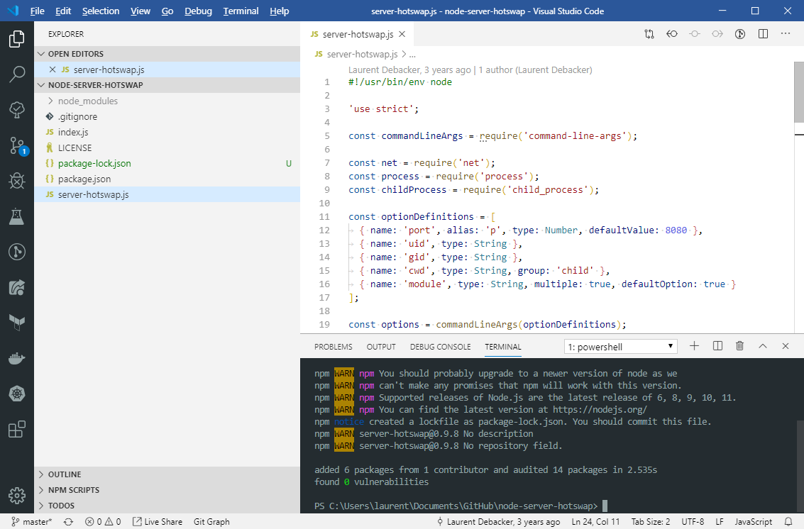

# Debacker Light Theme

If you want to try something different than dark themes, I hope you will enjoy it one ;-)

## Screenshot



## Installation

To install this color theme, either press Ctrl+P or Cmd+P and type:

`ext install debacker-light-theme`

Alternatively, you can find it on the [Visual Studio Code Marketplace](https://marketplace.visualstudio.com/items?itemName=debackerl.debacker-light-theme`).

## Bracket Pair Colorizer 2

If you use Bracket Pair Colorizer 2, it would be recommended to use the following settings:

```
"bracket-pair-colorizer-2.colors": [
	"#d6b100", /* goldish */
	"#ca4b51", /* redish */
	"#1258a7" /* blueish */
]
```
